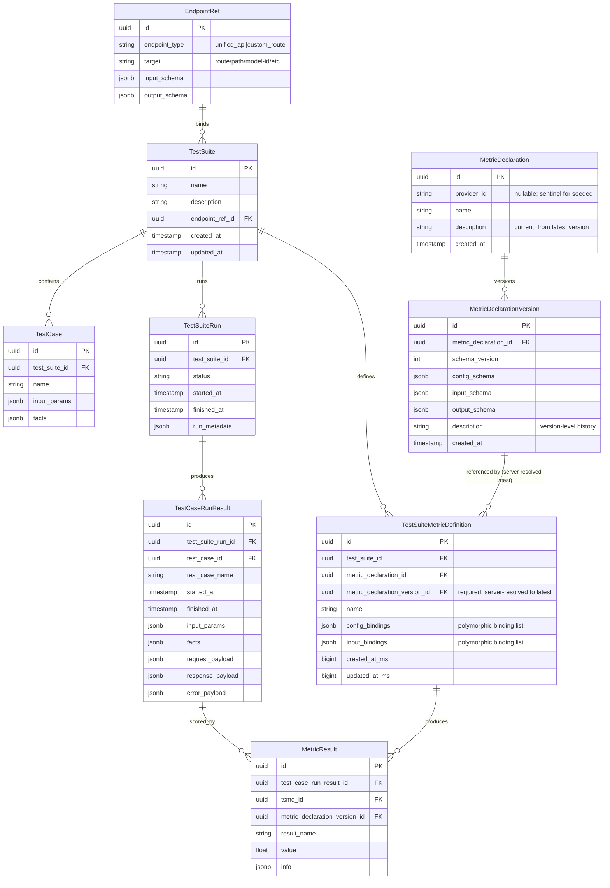

# Entity-Relationship Model Research

> **Status**: Draft  
> **Last Updated**: 2025-01-22  
> **Authors**: TBD

---

## 1. Purpose & Scope

### 1.1 Document Purpose

This document serves as a **research artifact** for designing the data model of the AI DIAL Evaluation Framework. It captures:

- Domain entities and their characteristics
- Data volume and access pattern estimations
- Technology options analysis with pros/cons
- Design decisions and their rationale

### 1.2 Scope

- **In Scope**: Core evaluation framework entities (test suites, test cases, evaluation runs, results, metrics)
- **Out of Scope**: Authentication/authorization data models, audit logs, system configuration

### 1.3 Goals

1. Define entity characteristics to inform technology choices
2. Document considered technologies with objective comparison
3. Provide foundation for implementation decisions

---

## 2. Context for AI Agents

> **Instructions for AI Agents**: This section provides context for continuing work on this document in future sessions.

### 2.1 How to Use This Document

- **Adding Entities**: Add new rows to the Entity Catalog table (Section 4)
- **Adding Technologies**: Add new subsections under Technology Comparison (Section 6)
- **Recording Decisions**: Use the Decision Log format in Section 7

### 2.2 Related Project Files

| File | Purpose |
|------|---------|
| [AGENTS.md](../../AGENTS.md) | Project coding guidelines and templates |
| [configuration.md](../configuration.md) | Application configuration reference |

### 2.3 Current Project Constraints

- **Database**: PostgreSQL (JDBC only, no JPA/Hibernate)
- **Framework**: Spring Boot > 3.x
- **Language**: Java 25

---

## 3. Domain Model Overview

### 3.1 High-Level Description

The Evaluation Framework manages the lifecycle of LLM/AI model evaluations:

1. **Metric Declarations (MD)** define metric input/output schemas and how to compute them (system-defined now; user-defined later)
2. **TestSuites** bind to a target endpoint (DIAL Unified API or custom route) and define a grid of **TestCases**
3. **TestSuiteMetricDefinitions (TSMD)** “materialize” which metrics apply to a suite and how metric inputs bind to suite/case/request/response data
4. A runner service executes **TestSuiteRuns**, producing per-case endpoint outcomes (**TestCaseRunResults**)
5. Metrics are computed per case and stored as named **MetricResults**; they can be recalculated later when MD logic changes but schemas remain compatible

### 3.3 Proposed Entity List (v0, based on current requirements)

> **Note**: This section replaces the initial “mock” entity list with an entity set grounded in current requirements (Metric Declarations, TestSuite schemas, runs, per-test-case results, and metric outputs).

#### 3.3.1 Metric Catalog

- **MetricDeclaration (MD)**: A metric definition that can be applied in TestSuites. Identity is **(provider_id, name)** so the same metric name from different providers (e.g. external metric provider services) is distinct.
  - **provider_id**: Optional; from config when synced from an external metric provider; null or a sentinel (e.g. `system`) for seeded/built-in declarations.
  - **name**: Metric name (e.g. `exact_match`, `retrieval`).
  - **description**: Current/latest description, denormalized from the most recent MetricDeclarationVersion; used for list/display without joining to versions.
  - Schemas and detailed description history live in MetricDeclarationVersion.
- **MetricDeclarationVersion**: Immutable versioned snapshot of MD content. Supports reproducibility (MetricResult references a specific version) and history when schemas or description change.
  - **Attributes (in scope)**: id, metric_declaration_id (FK), schema_version, config_schema (JSONB), input_schema (JSONB), output_schema (JSONB), description (TEXT), created_at.
  - **Deferred**: implementation_version, implementation_ref (out of scope for initial provider-sync feature).
  - When config_schema, input_schema, output_schema, or description change, a new version is created; MetricDeclaration.description is updated to the new version’s description.

#### 3.3.2 Test Suite Authoring

- **TestSuite**: The authored “evaluation specification”.
  - Binds to a **target endpoint** (DIAL Unified API: chat/completions OR a custom route)
  - Defines **input schema** / **output schema** expectations (at least at “contract” level)
  - Contains TestCases and selected metrics (materialized as TSMD)
- **TestCase**: One row in the TestSuite grid (importable from CSV).
  - Has `name`
  - Has `input_params` (JSON) for the target endpoint call
  - Has `facts` (JSON) for user-defined arbitrary columns/metadata
- **TestSuiteMetricDefinition (TSMD)**: Materialized metric selection for a given TestSuite.
  - Named (so UI can show a stable “metric column group”); unique per suite (case-insensitive)
  - References an MD; `metric_declaration_version_id` is required and server-resolved to the latest version on create/update
  - Contains `config_bindings` and `input_bindings` as JSONB arrays of polymorphic `MetricParameterBindingDto` entries
  - Each binding maps a metric parameter (`property`) to a source: `TestCase` (column name), `Response` (column name), or `Constant` (fixed value), discriminated by `$type`

#### 3.3.3 Execution History (written by runner service)

- **TestSuiteRun**: One execution of a TestSuite.
  - Created by a runner service, visible in UI (list, sort, filter)
  - Supports comparisons and trend analytics across runs of the same TestSuite
  - Avoid storing a full snapshot of all TestCases inside the run (too large); prefer storing run metadata and denormalizing required per-case data into `TestCaseRunResult`
- **TestCaseRunResult**: Per-TestCase result inside a run.
  - Stores endpoint invocation outcome: response OR error
  - Stores latency/timestamps (optional, but usually useful)
- **MetricResult**: Output of applying one TSMD to one TestCaseRunResult.
  - Each TSMD calculation produces 1..N named MetricResults as declared by the MD result schema
  - Fields: `name`, `value` \([0..1]\), optional `info` JSON

#### 3.3.4 Common “support” entities (likely needed)

- **Workspace / Project (Tenant)**: A container for scoping TestSuites, MDs, and Runs (depends on whether EF is multi-tenant / multi-workspace).
- **EndpointRef**: Normalized representation of the bound target endpoint (type: unified-api vs custom-route; route id/path; method; etc.).
- **ImportExportArtifact** (optional): If we want first-class tracking of CSV imports/exports (otherwise store as files elsewhere and keep only metadata).

### 3.2 Entity Relationship Diagram

> **Note**: This is a preliminary diagram. Update as entities are finalized.

---

## 4. Entity Catalog

### 4.1 Characteristics Legend

| Characteristic | Description | Values |
|----------------|-------------|--------|
| **Record Count** | Estimated number of records | Format: min / avg / max |
| **Record Size** | Average record size in bytes | S (<1KB), M (1-10KB), L (10-100KB), XL (>100KB) |
| **Mutability** | How often records change | Immutable, Rare, Frequent |
| **Access Pattern** | Read vs Write ratio | Read-heavy, Write-heavy, Balanced |
| **Retention** | How long data is kept | Permanent, Time-limited (N days), Archivable |

### 4.2 Entity Characteristics Table

<!-- 
  INSTRUCTIONS FOR AI AGENTS:
  - Add new entities as rows to this table
  - Use the legend above for value formats
  - Include rationale in the Notes column
-->

| Entity | Description | Record Count | Size | Mutability | Access | Retention | Notes |
|--------|-------------|--------------|------|------------|--------|-----------|-------|
| MetricDeclaration | Metric catalog entry; identity (provider_id, name); description = latest from version | 10 / 100 / 1K | S | Rare | Read-heavy | Permanent | provider_id null/sentinel for seeded; synced from external providers |
| MetricDeclarationVersion | Versioned MD content: config/input/output schemas + description (immutable) | 10 / 200 / 5K | S | Immutable | Read-heavy | Permanent | New version when schema or description change; implementation_version/ref deferred |
| TestSuite | Collection of test cases | 100 / 1K / 10K | S | Rare | Read-heavy | Permanent | *TODO: Validate estimates* |
| TestCase | Individual test definition | 1K / 50K / 500K | M | Rare | Read-heavy | Permanent | May contain large prompts |
| TestSuiteMetricDefinition | Materialized metric config within a suite (named) | 100 / 10K / 100K | S | Rare | Read-heavy | Permanent | Includes MD reference + JSONB config/input bindings (polymorphic: TestCase, Response, Constant) |
| TestSuiteRun | Execution record (written by runner) | 100 / 10K / 100K | S | Immutable | Read-heavy | Archivable | May store suite snapshot for reproducibility |
| TestCaseRunResult | Per-test-case result within a run | 10K / 500K / 5M | M | Immutable | Write-heavy → Read-heavy | Time-limited | Endpoint response/error per case |
| MetricResult | Named metric output per TSMD per TestCaseRunResult | 10K / 1M / 50M | S | Immutable | Write-heavy → Read-heavy | Time-limited | `value` in [0..1], plus optional `info` JSON |
| EndpointRef | Normalized endpoint binding metadata | 100 / 10K / 100K | S | Rare | Read-heavy | Permanent | Unified API vs custom route |
| Workspace | Tenant/workspace/project scope | 1 / 100 / 10K | S | Rare | Read-heavy | Permanent | Not needed for v0 (global scope) |

> **TODO**: Review and validate these estimates with stakeholders.

---

## 5. Relationships Matrix

### 5.1 Cardinality Notation

- `1:1` - One-to-One
- `1:N` - One-to-Many
- `N:M` - Many-to-Many

### 5.2 Relationships Table

| From Entity | To Entity | Cardinality | Cascade Delete | Frequent Joins | Notes |
|-------------|-----------|-------------|----------------|----------------|-------|
| EndpointRef | TestSuite | 1:N | No | Yes | Multiple suites can target the same endpoint definition |
| TestSuite | TestCase | 1:N | Yes | Yes | Suite deletion removes all cases |
| TestSuite | TestSuiteMetricDefinition | 1:N | Yes | Yes | TSMDs are part of suite definition; bindings stored as JSONB |
| MetricDeclaration | MetricDeclarationVersion | 1:N | Yes | No | Immutable version history |
| MetricDeclarationVersion | TestSuiteMetricDefinition | 1:N | No | No | Required FK; server-resolved to latest version on create/update |
| TestSuite | TestSuiteRun | 1:N | No | Yes | Keep run history |
| TestSuiteRun | TestCaseRunResult | 1:N | Yes | Yes | Run deletion removes per-case results |
| TestCaseRunResult | MetricResult | 1:N | Yes | Yes | Per-case metric results |
| TestSuiteMetricDefinition | MetricResult | 1:N | No | Yes | Enables aggregation per TSMD across run |

### 5.3 Common Query Patterns

<!-- 
  INSTRUCTIONS FOR AI AGENTS:
  Document the most frequent queries to inform indexing strategy
-->

| Query Pattern | Frequency | Entities Involved | Index Candidates |
|---------------|-----------|-------------------|------------------|
| List test suites with counts | High | TestSuite, TestCase | `test_suite_id` |
| List runs for a suite (filters/sort) | High | TestSuiteRun | `(test_suite_id, started_at)` |
| Get run results with test cases | High | TestSuiteRun, TestCaseRunResult, TestCase | `test_suite_run_id`, `test_case_id` |
| Filter/sort within run by metric output | High | MetricResult, TestCaseRunResult | `(tsmd_id, result_name, value)` |
| Aggregate metrics for a run | High | MetricResult | `(test_suite_run_id via join, tsmd_id, result_name)` |
| Search test cases by content | Medium | TestCase | Full-text index on `facts` and/or specific extracted fields |

### 5.4 MetricDeclaration Versioning & Recalculation (Draft)

#### 5.4.1 Goals

- **Reproducibility**: every stored `MetricResult` must be attributable to a specific `MetricDeclarationVersion`
- **Recalculation**: allow recomputing metrics over existing `TestCaseRunResult` payloads when MD logic changes but **schemas remain compatible** with existing TSMD bindings

#### 5.4.2 Recommended model

- **MetricDeclaration uniqueness**: `UNIQUE(provider_id, name)`. Same metric name from different providers (e.g. synced from different metric provider services) is distinct. Seeded/built-in declarations use null or a sentinel `provider_id`.
- **MetricDeclarationVersion (current scope)**:
  - Attributes: id, metric_declaration_id, schema_version, config_schema, input_schema, output_schema, description, created_at. **Deferred**: implementation_version, implementation_ref.
  - **schema_version**: increments when config_schema, input_schema, output_schema, or description change (new immutable version row).
- **TSMD pinning**:
  - `pinned_metric_declaration_version_id` is **optional**
  - If pinned: runner uses that version (strong reproducibility)
  - If not pinned: runner chooses the latest version by schema_version (allows rolling metric improvements)
- **Storing metric outputs**:
  - `MetricResult.metric_declaration_version_id` is required
  - Recalculation can either:
    - **Append** new rows for a newer `metric_declaration_version_id` (keeps history), or
    - **Replace** (delete/upsert) to keep only “latest” per run/case/metric (simpler UI; less history)

> **Open point**: pick append-vs-replace policy per environment (dev/prod) and per metric type. If we keep history, UI needs a “metric version” selector or “latest” semantics.

#### 5.4.3 Metric provider sync (scope)

- **In scope**: Sync job pulls metric declarations from one or more external metric provider services (same GET /metrics contract). Config lists providers by **provider_id** and base URL. Declarations are upserted by (provider_id, name); new MetricDeclarationVersion created when schema or description change. **Description** is stored at both MD (current) and MDV (history) level. Provider responses MAY send config_schema, input_schema, and output_schema as either JSON strings or JSON objects; the client SHALL accept both and normalize to a string for storage and structural comparison.
- **Out of scope**: Removal of metric declarations when a provider no longer returns that metric; separate auth per metric provider (requests use the identity of the service calling the provider).

### 5.5 Draft Uniqueness Constraints (for discussion)

- **MetricDeclaration**
  - **Required**: `UNIQUE(provider_id, name)` so the same metric name from different providers is distinct. `provider_id` is nullable (or sentinel) for seeded/built-in declarations.
- **TestSuiteMetricDefinition**
  - Unique: `(test_suite_id, name)` (TSMD is named in UI)
  - Optional: allow duplicates if UI needs it (not recommended)
- **TestCase**
  - **Required**: `name` is unique within a TestSuite: unique `(test_suite_id, name)`
  - **Rationale**: test cases across different runs are matched by `testCaseName` for comparisons/trends
  - Recommended: keep a surrogate `id` (uuid PK) and treat `name` as a stable business key
- **MetricResult**
  - Unique (history-preserving): `(test_case_run_result_id, tsmd_id, metric_declaration_version_id, result_name)`
  - Index for filtering: `(tsmd_id, result_name, value)` and `(test_case_run_result_id)`

### 5.6 Run Data Denormalization (Draft)

#### 5.6.1 Motivation

- Storing a full `TestSuite` snapshot (including all TestCases) inside `TestSuiteRun` can be **too large**
- We still need to query per-case results (`TestCaseRunResult`) anyway
- For common UI/analytics use-cases (compare runs, trends), we want to avoid frequent joins back to the authored `TestCase` table

#### 5.6.2 Proposed approach

- `TestSuiteRun` stores **run metadata only** (runner version, environment, tags, etc.) and references the authored suite by `test_suite_id`
- `TestCaseRunResult` stores a **copy** of:
  - `test_case_name` (business key used for cross-run matching)
  - `input_params` (JSONB)
  - `facts` (JSONB)
  - plus endpoint request/response/error payloads as JSONB

This keeps historical runs reproducible for analysis even if the authored TestSuite changes later, without duplicating the entire suite.

---

## 6. Technology Comparison

### 6.1 Evaluation Criteria

| Criterion | Weight | Description |
|-----------|--------|-------------|
| Query Performance | High | Speed of common queries |
| Write Performance | Medium | Insert/update throughput |
| Schema Flexibility | Medium | Ability to evolve schema |
| Operational Complexity | Medium | Maintenance overhead |
| Team Expertise | High | Existing team knowledge |
| Ecosystem/Tooling | Low | Available libraries and tools |

### 6.2 Comparison Matrix

<!-- 
  INSTRUCTIONS FOR AI AGENTS:
  - Add technologies as columns
  - Rate each criterion: Poor / Fair / Good / Excellent
  - Add specific notes for context
-->

| Criterion | Option A: Unified PG + JSONB | Option B: Dynamic per-suite PG | Option C: Hybrid PG (partition + generated cols) | Option D: Columnar lake (Parquet + table format) | Option E: Dual-store (PG metadata + ClickHouse serving) | Option F: MongoDB (document store) |
|-----------|-----------------------------|-------------------------------|-----------------------------------------------|-----------------------------------------------|---------------------------------------------------------|--------------------------------|
| Query Performance | Fair→Good with targeted indexes/gen cols | Excellent per-suite; weaker cross-suite | Good→Excellent for hot fields; cross-suite OK | Excellent for scans/aggregations; slower per-run UI | Excellent for filters/aggregations on ingested cols | Fair for ad-hoc; weaker for relational joins/analytics |
| Write Performance | Good; JSONB inserts fine | Good; DDL overhead when creating tables | Good; partitions help large volumes | Excellent append; compaction needed | Excellent append; upserts costlier | Good for document inserts; less efficient for relational updates |
| Schema Flexibility | Good (JSONB for facts/payloads) | Fair (runtime DDL per suite) | Good (stable base + extracted cols) | Excellent (schema evolution, time-travel) | Fair (schema in ClickHouse needs migration) | Excellent schemaless; weak typing |
| Operational Complexity | Low→Medium (index tuning) | High (runtime DDL/lifecycle) | Medium (partitioning + generated cols) | Medium→High (catalog, compaction) | Medium (dual-stack ingestion/ops) | Medium (another stack; manage replicas/indexes) |
| Team Expertise | High (assumed) | Medium (automation needed) | High (assumed) | Medium (data eng skills) | Medium (OLAP ops) | Medium (NoSQL ops) |
| Ecosystem/Tooling | Excellent | Excellent (same PG stack) | Excellent (same PG stack) | Good (Spark/DuckDB/Polars) | Good (BI/OLAP connectors) | Good (drivers, aggregation framework) |

### 6.3 Technology Details (Options A–F)

#### 6.3.1 Option A — Unified PostgreSQL + JSONB

**Description**: Stable relational tables; variable content (`facts`, payloads, metric `info`) kept in JSONB.

**Pros**:
- Simple operational model; no runtime DDL; migrations well understood
- Flexibility for heterogeneous `facts` and payloads
- Generated/stored columns + targeted indexes can accelerate hot fields

**Cons**:
- JSONB-heavy filters/sorts need careful indexing to stay performant
- Weaker type enforcement for `facts`

**Best For**:
- V1 baseline when flexibility is needed and team wants single-stack simplicity

---

#### 6.3.2 Option B — Dynamic per-suite PostgreSQL tables

**Description**: Runtime DDL to create per-suite tables so `facts` become typed columns; per-suite result tables are tailored.

**Pros**:
- Best per-suite grid/query performance; strong typing and indexing
- Natural fit when UI needs many sortable, typed custom columns per suite

**Cons**:
- High operational/migration complexity (runtime DDL, lifecycle, permissions)
- Harder cross-suite analytics; schema evolution risk with concurrent edits/imports

**Best For**:
- Suites with strict per-suite performance/typing requirements where cross-suite analytics are secondary

---

#### 6.3.3 Option C — Hybrid PostgreSQL (partitioned + generated columns)

**Description**: Unified tables, partitioned by `test_suite_id` and/or time; select “hot” JSONB fields extracted into generated/stored columns.

**Pros**:
- Better performance for common filters/sorts without runtime DDL
- Keeps global queryability; partitions help manage large run volumes/retention

**Cons**:
- Requires selecting the right extracted fields up front
- Slightly higher schema/ops complexity than Option A

**Best For**:
- When we want to stay in unified PG but need improved perf for known hot fields

---

#### 6.3.4 Option D — Columnar lake (Parquet + table format)

**Description**: Runs/metrics stored as Parquet with a lake table format (Iceberg/Delta/Hudi) in object storage; authored metadata (suites/TSMD/MD) in a transactional store (e.g., Postgres).

**Pros**:
- Cheap scalable storage; excellent for large scans and batch analytics
- Schema evolution and time-travel support; append-friendly for recalculation

**Cons**:
- Higher latency for per-run UI unless paired with a serving index/cache
- More moving parts (catalog, compaction/vacuum jobs)

**Best For**:
- Analytics-at-scale and historical/recalc use cases where latency can be cached/served elsewhere

---

#### 6.3.5 Option E — Dual-store (Postgres metadata + ClickHouse serving/analytics)

**Description**: Postgres holds authored metadata; ClickHouse ingests `TestSuiteRun` / `TestCaseRunResult` / `MetricResult` (lean, append). Payload blobs may live in object storage.

**Pros**:
- Fast filtering/aggregation for trends/comparisons
- Append pattern fits recalculation-by-append

**Cons**:
- Dual-stack operations; ingestion pipeline required
- Upserts/mutations costlier than append

**Best For**:
- Interactive analytics where metric/result querying speed is critical

---

#### 6.3.6 Option F — MongoDB (document store)

**Description**: Document-oriented NoSQL store for flexible JSON payloads.

**Pros**:
- Schema-flexible without migrations; good ergonomics for JSON
- Horizontal scaling patterns well understood

**Cons**:
- Weaker relational integrity; cross-document joins are limited
- Less ergonomic for complex analytics than SQL/OLAP engines
- Adds another operational stack alongside JDBC expectations

**Best For**:
- If we prioritize schemaless authoring and can accept weaker relational guarantees (not the default path)

---

### 6.4 Schema Strategy Options (Options A–F)

> Context: EF is a storage backend (PostgreSQL + JDBC). Data shapes vary by TestSuite (custom facts columns, endpoint schemas, metric outputs).

**Summary of options A–F**
- **A: Unified + JSONB** — simplest ops/migrations; moderate perf with selective indexes.
- **B: Dynamic per-suite tables** — best per-suite grid perf; runtime DDL complexity; harder cross-suite analytics.
- **C: Hybrid (unified + partitioning + generated columns)** — no runtime DDL; better perf than A for hot fields; still cross-suite friendly.
- **D: Columnar lake (Parquet + table format)** — cheap scalable storage and great batch analytics; needs serving/cache for low-latency UI.
- **E: Dual-store (PG metadata + ClickHouse serving)** — fast interactive analytics; dual-stack ingestion/ops.
- **F: MongoDB (document store)** — schemaless flexibility; weaker relational guarantees/analytics.

#### 6.4.1 Option A — Unified schema with JSONB (baseline)

- **How it works**: keep a stable set of tables (`test_suite`, `test_case`, `test_suite_run`, `test_case_run_result`, `metric_result`) and store variable content in JSONB (`facts`, payloads, metric `info`, etc.).
- **Pros**:
  - Simple migrations and operational model
  - No runtime DDL; fits well with Flyway
  - Works with “fixed named outputs” metrics by indexing `(tsmd_id, result_name, value)`
- **Cons**:
  - JSONB-heavy querying can be slower unless we add targeted indexes/generated columns
  - “Facts” columns are not strongly typed

#### 6.4.2 Option B — Dynamic table generation per TestSuite

- **How it works**: create dedicated tables per TestSuite (or per endpoint schema) so “Facts” become real columns and per-suite result tables are tailored.
- **Pros**:
  - Best query performance for grid-like access patterns
  - Strong typing and straightforward indexing on frequently-used columns
- **Cons**:
  - High operational and migration complexity (runtime DDL, lifecycle management, permissions)
  - Harder to run cross-suite queries and global reporting
  - More difficult to keep schema evolution safe (especially with concurrent edits and imports)

#### 6.4.3 Option C — Hybrid: Unified schema + Postgres partitioning + extracted columns

- **How it works**:
  - Keep unified tables, but **partition** high-volume tables by `test_suite_id` and/or by time (for retention)
  - Add **generated/stored columns** for a small set of “hot” fields extracted from JSONB (e.g., selected facts, selected request/response fields)
- **Pros**:
  - Avoids runtime DDL while still improving performance for common filters/sorts
  - Keeps global queryability
- **Cons**:
  - Requires careful up-front selection of extracted fields
  - Slight schema complexity increase

#### 6.4.4 Option D — Columnar object storage (Parquet) + lake table format

- **How it works**: store run/metric facts as Parquet in object storage (e.g., S3/MinIO) with a table format (Iceberg/Delta/Hudi); keep metadata (suites/TSMD/MD) in a transactional store (e.g., Postgres).
- **Pros**:
  - Cheap scalable storage; excellent for large scans and batch analytics
  - Schema evolution support via table formats; time-travel for recalculation history
  - Works well with append-only metric recalculation
- **Cons**:
  - Higher latency for per-run UI queries unless paired with a serving index (e.g., DuckDB/Polars cache, or a small OLAP like ClickHouse)
  - More moving parts (lake catalog, compaction/vacuum jobs)

#### 6.4.5 Option E — Dual-store with Postgres (metadata) + ClickHouse (serving/analytics)

- **How it works**: Postgres holds authored metadata; ClickHouse ingests `TestSuiteRun`/`TestCaseRunResult`/`MetricResult` (lean, append). Optional object storage for payload blobs.
- **Pros**:
  - Fast filtering/aggregation on metric values; good for trends and comparisons
  - Supports append-friendly recalculation
- **Cons**:
  - Dual-stack ops; ingestion pipeline needed
  - Mutations/upserts costlier (but recalculation-as-append fits well)

#### 6.4.6 Option F — MongoDB (document store)

- **How it works**: store authored suites, cases, runs, and metrics as documents; rely on Mongo’s aggregation framework for queries.
- **Pros**:
  - Flexible schema without migrations
  - Good developer ergonomics for JSON payloads
- **Cons**:
  - Weaker relational guarantees and joins vs RDBMS
  - Less suited for complex analytics compared to SQL/OLAP engines
  - Adds a separate operational stack alongside JDBC/Postgres

> **Recommendation (draft)**: start with **Option A** plus selective indexing; consider **Option C** as volume/hot-fields emerge. **Option B** only if the UI requires many typed, sortable “facts” columns with strict per-suite performance. **Option D/E** when analytics scale or latency demands a serving layer; **Option F** only if schemaless authoring outweighs relational/analytics needs.

### 6.5 Proposed Dual Data-Source Architecture (meta + analytics)

We will expose two pluggable data sources with repository interfaces:
- **Meta repository interface**: authoring metadata (TestSuite, TestCase, TSMD, MD versions, bindings).
- **Analytics repository interface**: runs/results (TestSuiteRun, TestCaseRunResult, MetricResult), append-oriented, read-heavy.

**Configuration pattern**
- `datasource.meta.type = POSTGRES` (v1 default; could support MySQL/etc later)
- `datasource.analytics.type = POSTGRES` (v1 small envs) or `CLICKHOUSE` (v2 larger envs); future storages can be added.

**Runtime binding**
- On startup, inject the implementations matching the configured types.
- Supported combinations:
  - v1: `meta=POSTGRES`, `analytics=POSTGRES`
  - v2: `meta=POSTGRES`, `analytics=CLICKHOUSE`
  - Future: additional adapters as needed.

**Shared contract for analytics repo (portable across PG/CH)**
- Append-friendly shape with minimal joins in the analytics store:
  - Keys: `test_suite_id`, `test_suite_run_id`, `test_case_name` (business key), `tsmd_id`, `metric_declaration_version_id`, `metric_result_name`
  - Values: `value` (0..1), `info` (JSON), timestamps, tags
  - Optional: request/response/error refs or URIs for large payloads (blobs offloaded to object storage)
- Keep authored metadata in the meta store; analytics store is optimized for read/aggregate.

**Pros**
- Flexibility: low-volume envs can stay PG+PG; high-volume can switch analytics to CH without changing business logic.
- Isolation of concerns: metadata integrity in meta store; performance/aggregation in analytics store.
- Incremental path: ship v1 with one stack; add ingestion/adapter for CH in v2.
- Extensibility: adding a new backend is implementing the repo interface + wiring config.

**Cons / costs**
- Two-stack ops when analytics ≠ meta (ingestion/ETL, monitoring, migration/backfill story needed).
- Schema drift risk: must keep the analytics contract stable and versioned.
- More code paths to test (PG adapter, CH adapter, future adapters).

<!-- 
  TEMPLATE FOR ADDING NEW TECHNOLOGY:
  
  #### 6.3.N Technology Name
  
  **Description**: Brief description of the technology.
  
  **Pros**:
  - Point 1
  - Point 2
  
  **Cons**:
  - Point 1
  - Point 2
  
  **Best For**:
  - Use case 1
  - Use case 2
-->

---

## 7. Open Questions & Decisions

### 7.1 Open Questions

<!-- 
  INSTRUCTIONS FOR AI AGENTS:
  Track unresolved questions that need stakeholder input
-->

| ID | Question | Context | Status | Answer |
|----|----------|---------|--------|--------|
| Q1 | What is the expected data retention period for results? | Affects storage sizing | Open | Configurable; default 3 months; can be overridden per TestSuite/Run (needs confirmation) |
| Q2 | Should test case inputs support binary data (images)? | Affects record size estimates | Open | Likely yes (inputs/outputs/facts may contain binaries); approach TBD |
| Q3 | Is multi-tenancy required? | Affects schema design | Answered | Global scope for v0 |
| Q4 | What are the SLA requirements for query response times? | Affects indexing strategy | Open | Target “few seconds” for UI queries; needs confirmation |
| Q5 | Do MetricDeclarations need versioning (immutable versions for reproducibility)? | Impacts references from TSMD and historical runs | Answered | Yes; also allow recalculation over existing results when schema remains compatible |
| Q6 | How should we represent Metric result schemas: fixed list of named outputs, or allow dynamic outputs? | Impacts storage model and UI columns | Answered | Fixed list of named outputs |
| Q7 | Should each TestSuiteRun store a full snapshot of executed TestSuite + TSMD bindings (JSON), or only references to current versions? | Impacts analytics/reproducibility | Open | Prefer full JSON snapshot (avoid heavy joins) |
| Q9 | For metric recalculation, do we keep historical versions of MetricResults (append) or only latest (replace)? | Impacts storage size and UI semantics | Open | Prefer append; replace is acceptable fallback |
| Q8 | What is the scope container: Workspace/Project per DIAL, or global? | Impacts keys, ACLs, and uniqueness | Answered | Global for now |
| Q10 | How should `TestCase.facts` be stored long-term? | Affects schema strategy | Open | Considering dynamic DDL for `test_case` to type facts; current JSONB decision withdrawn |

### 7.2 Decision Log

<!-- 
  INSTRUCTIONS FOR AI AGENTS:
  Record decisions using this format:
  
  | ID | Decision | Rationale | Date | Decided By |
-->

| ID | Decision | Rationale | Date | Decided By |
|----|----------|-----------|------|------------|
| D1 | Use PostgreSQL as primary database | Team expertise, existing infrastructure | TBD | TBD |
| D3 | MetricDeclaration is versioned; MetricResult stores the MD version used; allow recalculation when schemas stay compatible | Enables reproducibility + “re-run metric” capability without rerunning endpoint calls | 2026-01-23 | User |
| D4 | MetricDeclaration output schema is a fixed list of named outputs | Enables stable UI columns, indexing, and predictable aggregation | 2026-01-23 | User |
| D5 | EF scope is global (no workspace/tenant in v0) | Simplifies v0; revisit when multi-tenancy is required | 2026-01-23 | User |
| D6 | Prefer storing `test_suite_snapshot` on TestSuiteRun (tentative) | Reduces join complexity; improves analytics reproducibility | 2026-01-23 | User (tentative) |
| D7 | `TestCase.name` is unique within a TestSuite and is used as the business key for cross-run comparisons | Enables stable matching of results across runs/trends | 2026-01-23 | User |
| D8 | Prefer metric recalculation by appending MetricResult rows for newer MetricDeclarationVersions (tentative) | Preserves history; allows comparing metric revisions | 2026-01-23 | User (tentative) |
| D9 | MetricDeclaration identity is (provider_id, name); enforce UNIQUE(provider_id, name). provider_id from config for synced providers; null/sentinel for seeded | Distinguishes same metric name from different providers; supports multiple metric provider services | 2026-02-23 | User |
| D10 | Description on both MetricDeclaration (current/latest) and MetricDeclarationVersion (history). MD.description denormalized from latest version | Descriptions can reflect config/schema; history preserved at version level | 2026-02-23 | User |
| D11 | MetricDeclarationVersion in scope: id, metric_declaration_id, schema_version, config_schema, input_schema, output_schema, description, created_at. implementation_version and implementation_ref deferred | Aligns with external GET /metrics contract; keeps versioning focused on schema + description | 2026-02-23 | User |
| D12 | Sync from metric providers: no removal of declarations when a metric is missing from provider response; separate auth per provider out of scope (use service identity) | Simplifies v0 sync and security model | 2026-02-23 | User |

---

## 8. Next Steps

1. [ ] Validate entity characteristics with stakeholders
2. [ ] Complete technology comparison analysis
3. [ ] Make technology selection decision
4. [ ] Create detailed schema design document
5. [ ] Define Flyway migration strategy

---

## Appendix A: Glossary

| Term | Definition |
|------|------------|
| **Test Suite** | A named collection of related test cases |
| **Test Case** | A single test with input, expected output, and evaluation criteria |
| **Evaluation Run** | An execution of a test suite against a specific model |
| **Result** | The outcome of evaluating a single test case |
| **Metric** | A measurement method for scoring results (e.g., exact match, BLEU score) |

---

## Appendix B: References

- [PostgreSQL JSONB Documentation](https://www.postgresql.org/docs/current/datatype-json.html)
- [MongoDB Data Modeling](https://www.mongodb.com/docs/manual/data-modeling/)
- Project: [AGENTS.md](../../AGENTS.md) - Coding guidelines
