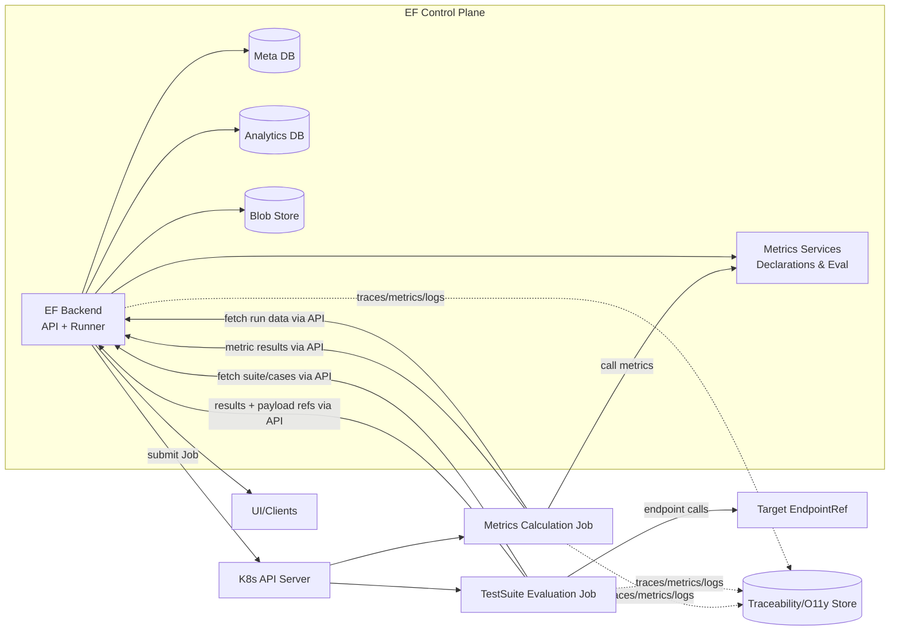
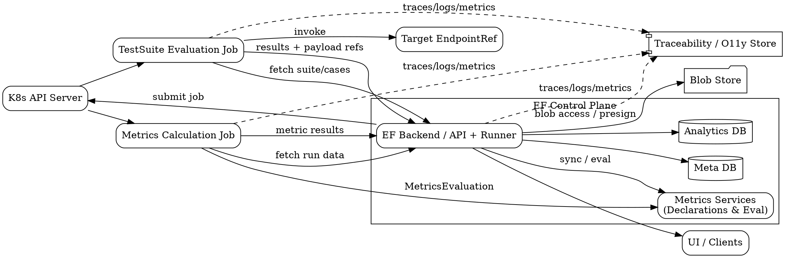

# Infrastructure Architecture (Draft)

> **Status**: Draft  
> **Last Updated**: 2026-01-24  
> **Scope**: Cloud-agnostic (AWS/GCP/Azure/on-prem), Kubernetes-first. Managed services only if explicitly approved.

## 1. Purpose & Scope
- Describe infrastructure components for the Evaluation Framework (EF): backend, runner, analytics, metrics services.
- Capture data flows across meta/analytics stores, Kubernetes jobs, and metrics calculation services.
- Provide initial choices and open questions; refine iteratively.

## 2. Components (current vision)
- **EF Backend** (Spring Boot, JDBC, OIDC/JWT):
  - **Meta storage**: authoring data (TestSuite, TestCase, TSMD, MetricDeclaration + versions, EndpointRef).
  - **Analytics storage**: runs/results (TestSuiteRun, TestCaseRunResult, MetricResult); append-oriented.
  - **Evaluation Runner**: submits Kubernetes Jobs, tracks status, exposes APIs.
- **TestSuite Evaluation Job** (K8s Job):
  - Reads TestSuite/TestCases + bindings, calls EndpointRef per TestCase, writes outcomes to analytics store, optional payloads to object storage.
- **Metrics Calculation Job** (K8s Job):
  - Reads TestRun/TestCaseRunResults, maps to metric requests, calls Metrics services, writes MetricResults to analytics store.
- **Metrics Services (internal, stateless)**:
  - Expose `MetricsEvaluation` endpoint; provide `MetricsDeclaration` list.

## 3. High-Level Diagram

### Alternative Diagram: GraphViz DOT

## 4. Deployment Model
- Cloud-agnostic; all workloads on Kubernetes.
- Avoid managed service assumptions unless explicitly approved; default to self-managed Postgres, optional object storage (S3-compatible).
- Two-data-source pattern: `meta` and `analytics` can both be Postgres initially; analytics can be swapped to a specialized store later (e.g., ClickHouse) without changing the contract.

## 5. Data Stores
- **Meta DB**: authoritative metadata; transactional; Postgres by default.
- **Analytics DB**: append-friendly runs/results; Postgres initially; could evolve to dual-store (Postgres + ClickHouse) if volume/latency requires.
- **Retention**: defaults set per environment, overridable per TestSuite/TestRun.
- **Blob/Object Storage (WIP)**: offload large request/response/error payloads and artifacts to S3/MinIO; keep lightweight references in analytics DB; see Section 14 for v1 policy notes.

## 6. Workload Orchestration
- **Default (Phase 1)**: Plain Kubernetes Jobs submitted by the Runner.
- **Alternatives (for later evaluation)**:
  - **Argo Workflows**: native K8s CRDs, DAG-first, good UI; adds CRD/ctl complexity.
  - **Tekton**: K8s-native pipelines; strong for CI-style tasks; less out-of-box UI.
  - **Airflow**: rich DAGs and scheduling; heavier stack, separate scheduler, non-K8s-native unless using K8s executor.
  - **K8s Jobs + lightweight controller**: minimal deps; fewer DAG features; simplest ops.
- **DAG need between TestSuite Evaluation and Metrics Calculation**: deemed overkill for now; sequential submission is sufficient. Revisit if we add branch/parallel steps or complex retries.

## 7. Messaging vs Direct Calls
- **Current choice**: Direct invocation from Runner to Metrics Calculation and from Metrics Job to Metrics Services.
- **Pros (direct)**: Lower ops cost, simpler failure modes, fewer components.
- **Cons (direct)**: Harder decoupling, limited buffering/backpressure, retries handled in-process.
- **If queue later**: Kafka/Rabbit/SQS could add durability, backpressure, and async retries but increases cost/complexity.

## 8. Data Flows (happy path)
1) Authoring via EF Backend → Meta DB (TestSuite, TestCases, TSMD, MD versions).  
2) Run triggered → Runner submits Eval Job.  
3) Eval Job:
   - Fetches suite/cases/bindings.
   - Calls EndpointRef per test case; captures response/error + latency.
   - Writes TestSuiteRun/TestCaseRunResult via Backend API to Analytics DB; large payloads optionally routed via Backend (presigned/blob abstraction).
4) Metrics Calculation Job:
   - Reads TestRun/TestCaseRunResults via Backend API.
   - Builds metric requests; calls Metrics Services (`MetricsEvaluation`).
   - Writes MetricResults (with MetricDeclarationVersion reference) via Backend API to Analytics DB.
5) UI/clients query Backend → Analytics DB for runs/results/metrics; traceability links to Job IDs and metric calls.

## 9. Security & Networking
- Auth: OIDC/JWT for EF Backend; runner jobs and metrics services reuse same IdP.
- Network isolation: namespaces, private subnets, service mesh optional—open question on required level.
- Service-to-service auth between Metrics Job and Metrics Services: open question.
- Secrets: store in K8s secrets (or external secret manager if approved).

## 10. Observability
- Stack: Prometheus/Grafana + OpenTelemetry (traces/logs/metrics).
- Traceability: correlate `TestSuiteRun` with K8s Job UID and metric service calls (propagate correlation IDs); store traces/metrics/logs in a traceability store (e.g., OTLP backend).
- Logging: structured logs; ship via fluentd/Vector/OTel collector (choice TBD).

## 11. Scaling & SLA (current assumptions)
- Concurrency: up to 10 concurrent TestSuite runs (open for adjustment).
- Metrics Evaluation latency: metric-dependent (ms to minutes); design for async + retries.
- SLO for UI/analytics queries: not defined—open question (see Section 15 for context/examples).

## 12. Open Questions
- Final decision on retention policies per environment for analytics data and blobs.
- Required network isolation level (namespaces only vs private subnets vs service mesh).
- Auth method between Metrics Calculation Job and Metrics Services (JWT service accounts, mTLS, etc.).
- Do we standardize on object storage for payloads in v1 or keep everything in Analytics DB initially?
- What SLOs should we target for UI/analytics queries (p95 latency, freshness)?

## 13. Assumptions
- Metrics services are internal and stateless, expose `MetricsEvaluation` and `MetricsDeclaration`.
- No managed services are assumed by default; can be added if/when approved.
- Kubernetes is available in all target environments.

## 14. Payload Storage Policy (v1 vs later)
- **v1 default (proposed)**: Store small/medium payloads directly in Analytics DB; offload large payloads to object storage with references in Analytics DB.
- **Pros of object storage**: cheaper for large blobs, reduces DB bloat/I/O, easier retention via lifecycle rules.
- **Cons of object storage**: extra hop to fetch payloads, need signed URLs or service auth, consistency between DB refs and blobs.
- **Access pattern (recommended)**: Jobs call Backend, which mediates blob writes/reads (e.g., issues presigned URLs or streams), keeping direct blob access limited to Backend for auth/logging.
- **Next steps**: define size threshold (e.g., >256KB → object store), retention alignment between DB rows and blobs, cleanup jobs for orphaned blobs, and whether presigned URL TTLs are needed for jobs.

## 15. UI/Analytics SLO Context (to help choose targets)
- **Latency (p95 suggestions to pick from)**:
  - Suite runs list: 1–3s
  - Run details (cases + metrics filtered): 2–5s
  - Aggregations/trends: 3–8s (could be cached/precomputed)
- **Freshness**:
  - New run visibility after completion: near real-time (≤30s) or relaxed (≤5m).
  - Metrics recalculation visibility: immediate append vs periodic ingestion (e.g., ≤10m).
- Please select acceptable ranges per view; we can tune indexing/caching accordingly.

## 16. Metrics Declaration Sync (Backend ↔ Metrics Services)
- **Requirement**: EF Backend periodically (or on demand) fetches `MetricsDeclaration` list from Metrics Services, reconciles with Meta DB, and updates the catalog used by authoring and runner.
- **High-level algorithm**:
  1. Fetch current declarations from Metrics Services (with version/implementation identifiers).
  2. Compare with Meta DB records by stable metric key/name.
  3. Insert new declarations; update metadata for existing ones; optionally deactivate removed ones (flag, not delete).
  4. Record `MetricDeclarationVersion` changes when implementation/schema versions change (to preserve reproducibility).
  5. Expose a health/status endpoint showing last sync time and drift (added/updated/removed counts).
  6. Provide a manual “sync now” admin endpoint plus scheduled sync (configurable interval).
